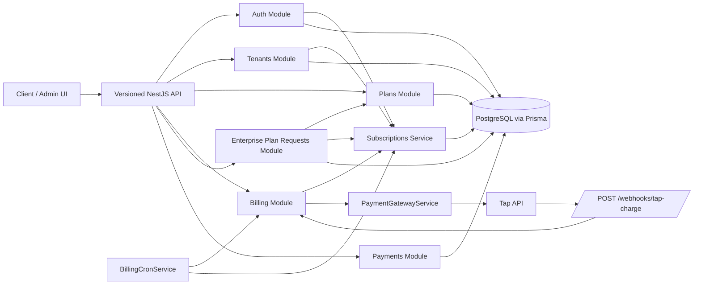

# SaaS Plans and Subscriptions Demo Architecture

## System Summary

This repository is a NestJS 11 REST API that models a multi-tenant SaaS billing system with registration, tenant bootstrap, standard plans, enterprise custom plans, subscription lifecycle management, quota enforcement, and Tap payment integration. The application boots a versioned API (`/v1/*`), applies global JWT and role guards, persists data with Prisma on PostgreSQL, and runs scheduled billing lifecycle jobs with `@nestjs/schedule` (`src/main.ts`, `src/app.module.ts`, `src/database/prisma.service.ts`).

Core runtime and infrastructure files:

- `package.json`: Nest build/start/test scripts and runtime dependencies.
- `.env.example`: required env keys for HTTP, JWT, hashing, Swagger, and Tap.
- `prisma.config.ts`: Prisma schema directory, migrations path, and seed command.
- `prisma/schema/schema.prisma`: Prisma generator and PostgreSQL datasource.
- `prisma/migrations`: concrete tables, indexes, and foreign keys.
- `nest-cli.json`, `tsconfig.json`, `tsconfig.build.json`, `eslint.config.mjs`: build and lint configuration.

## Technology Stack

- Framework: NestJS 11 (`package.json`).
- Runtime: Node.js + TypeScript 5 (`package.json`).
- ORM: Prisma 7 with PostgreSQL adapter `@prisma/adapter-pg` (`package.json`, `src/database/prisma.service.ts`).
- Auth: `@nestjs/jwt`, `passport-jwt`, custom guard/decorators (`package.json`, `src/common/jwt/jwt.service.ts`, `src/common/guards/jwt.guard.ts`).
- Password hashing: Argon2 with application secret (`src/common/utils/hashing.utils.ts`).
- Scheduling: `@nestjs/schedule` hourly and 30-minute cron jobs (`package.json`, `src/app.module.ts`, `src/billing/billing-cron.service.ts`).
- Logging: `nestjs-pino` + `pino-http` (`package.json`, `src/app.module.ts`, `src/main.ts`).
- API documentation: Swagger protected by HTTP Basic auth (`src/main.ts`, `.env.example`).
- Payment integration: Tap charge API via `@nestjs/axios` (`package.json`, `src/payment-gateway/tap-payment-provider/tap-payment-provider.service.ts`).

## Runtime Architecture

### Cross-cutting pipeline

- `ConfigModule.forRoot()` loads `.env` globally and validates required keys with `validateEnv()` (`src/app.module.ts`, `src/config/env.validation.ts`).
- `LoggerModule.forRoot()` configures pino transport and level (`src/app.module.ts`).
- `JwtGuard` is registered as a global `APP_GUARD`; it skips `@Public()` endpoints and injects decoded JWT claims into `request.user` (`src/app.module.ts`, `src/common/guards/jwt.guard.ts`, `src/common/decorators/public.decorator.ts`).
- `RolesGuard` is also global and enforces `@Roles()` metadata (`src/common/guards/roles.guard.ts`, `src/common/decorators/roles.decorator.ts`).
- `SubscriptionGuard` is route-level and enforces subscription state, plan kind, enterprise ownership, and quota checks (`src/common/guards/subscription.guard.ts`, `src/common/decorators/require-subscription.decorator.ts`, `src/common/decorators/require-quota.decorator.ts`).
- Global `ValidationPipe` strips unknown fields and returns the first validation error only (`src/main.ts`).
- `helmet()` is enabled and CORS origin defaults to `*` unless `ORIGIN` is set (`src/main.ts`).
- `AllExceptionsFilter` is registered globally for normalized error handling (`src/main.ts`).

### Layers

- Controllers expose HTTP routes and role metadata.
- Services implement business rules and Prisma transactions.
- Prisma service owns database connectivity and globally omits `user.password` and `user.verificationCode` from normal query results (`src/database/prisma.service.ts`).
- Payment gateway services isolate Tap-specific request/response handling.
- Cron services orchestrate timed billing actions.

## Directory Structure

- `src/main.ts`: app bootstrap, versioning, Swagger, CORS, Helmet, exception filter.
- `src/app.module.ts`: root composition of all modules and global guards.
- `src/auth/`: sign-up, sign-in, verification token flow.
- `src/users/`: self-profile and admin user management.
- `src/tenants/`: tenant profile, subscription, usage, enterprise-only endpoint, quota usage simulation.
- `src/plans/`: admin CRUD for plans plus landing-page plan listing.
- `src/subscriptions/`: trial bootstrap, upgrade/downgrade scheduling, activation, renewal failure handling, events, and quota helpers.
- `src/billing/`: user billing endpoints, Tap webhook entrypoint, recurring billing cron jobs.
- `src/payments/`: payment history query services/controllers.
- `src/payment-gateway/`: provider abstraction and Tap implementation.
- `src/enterprise-plan-requests/`: tenant enterprise request workflow and admin approval flow.
- `src/common/`: guards, decorators, enums, DTO wrappers, JWT helper, filters, shared utils.
- `src/database/`: Prisma module/service.
- `prisma/schema/`: split Prisma models by domain.
- `prisma/migrations/`: SQL migrations.
- `prisma/seed-data/` and `prisma/seed.ts`: seed admin user and default plans.
- `src/generated/prisma/`: generated Prisma client output.
- `test/`: e2e test config and placeholder spec.

## Domain Model

Primary tables and relationships:

- `users`: identity, verification, role (`prisma/schema/users.prisma`).
- `tenants`: one tenant per owner user (`prisma/schema/tenants.prisma`).
- `plans`: standard public plans and tenant-bound `enterprise_custom` plans (`prisma/schema/plans.prisma`).
- `tenant_subscriptions`: one subscription per tenant with lifecycle state, plan snapshots, Tap agreement/card/customer IDs, billing timestamps, retry count, and pending downgrade/upgrade target (`prisma/schema/subscriptions.prisma`).
- `tenant_usages`: mutable counters for projects/users/sessions/requests (`prisma/schema/subscriptions.prisma`).
- `subscription_events`: append-only business events for trialing, payment, downgrade, cancellation, suspension, enterprise plan creation (`prisma/schema/subscriptions.prisma`).
- `subscription_payments`: payment ledger keyed by provider event/payment refs (`prisma/schema/payments.prisma`).
- `enterprise_plan_requests` and `enterprise_plan_request_events`: enterprise negotiation workflow (`prisma/schema/enterprise-plan-request.prisma`).

## Major Features

### Authentication and tenant bootstrap

Purpose: register a user, create a tenant, verify ownership, then issue JWT access tokens.

Key files:

- `src/auth/auth.controller.ts`
- `src/auth/auth.service.ts`
- `src/common/jwt/jwt.service.ts`
- `src/common/utils/hashing.utils.ts`
- `src/users/users.service.ts`
- `src/tenants/tenants.service.ts`

### Standard plan catalog and landing-page exposure

Purpose: seed and manage public plans, expose active standard plans to unauthenticated clients.

Key files:

- `prisma/seed-data/plan.seed.data.ts`
- `src/plans/plans.controller.ts`
- `src/plans/plans.service.ts`
- `src/billing/billing.controller.ts`

### Trial subscription bootstrap

Purpose: start a one-time free trial subscription after account verification using the first active standard plan with `trialDays > 0`.

Key files:

- `src/auth/auth.service.ts`
- `src/subscriptions/subscriptions.service.ts`
- `prisma/seed-data/plan.seed.data.ts`

### Paid upgrades, downgrades, cancellation, and recurring billing

Purpose: move a tenant from trial/free to paid, schedule downgrades, cancel future renewals, and run recurring charges.

Key files:

- `src/billing/billing.controller.ts`
- `src/billing/billing.service.ts`
- `src/subscriptions/subscriptions.service.ts`
- `src/billing/billing-cron.service.ts`
- `src/billing/webhook/billing-webhook.controller.ts`
- `src/billing/webhook/billing-webhook.service.ts`
- `src/payment-gateway/tap-payment-provider/tap-payment-provider.service.ts`

### Subscription events and payment history

Purpose: let tenant and admin callers inspect audit history and payment ledger entries.

Key files:

- `src/payments/payments.service.ts`
- `src/subscriptions/subscription-events.service.ts`
- `src/tenants/tenants.controller.ts`
- `src/payments/payments.dashboard.controller.ts`
- `src/subscriptions/subscriptions.dashboard.controller.ts`

### Quota guards and usage simulation endpoints

Purpose: enforce plan quotas both at guard level and service level, then mutate usage counters.

Key files:

- `src/common/guards/subscription.guard.ts`
- `src/subscriptions/subscription-usage-limits.service.ts`
- `src/tenants/tenant-profiles.service.ts`
- `src/tenants/tenants.controller.ts`

### Enterprise request and custom plan workflow

Purpose: allow tenants to request enterprise capacity and admins to create tenant-private plans.

Key files:

- `src/enterprise-plan-requests/enterprise-plan-requests.controller.ts`
- `src/enterprise-plan-requests/enterprise-plan-requests.dashboard.controller.ts`
- `src/enterprise-plan-requests/enterprise-plan-requests.service.ts`

## External Integrations

- PostgreSQL via Prisma adapter (`src/database/prisma.service.ts`).
- Tap charges/tokens API via HTTPS (`src/payment-gateway/tap-payment-provider/tap-payment-provider.service.ts`).
- Tap webhook signature verification using HMAC SHA-256 over selected fields and `TAP_PAYMENT_API_KEY` (`src/payment-gateway/tap-payment-provider/tap-payment-provider.service.ts`).
- Swagger UI secured with `SWAGGER_USER` / `SWAGGER_PASSWORD` (`src/main.ts`, `.env.example`).

## Mermaid Diagram

## Architectural Notes and Current Constraints

- API versioning is URI-based and defaults to `/v1`, but the Tap webhook route is explicitly version-neutral (`src/main.ts`, `src/billing/webhook/billing-webhook.controller.ts`).
- There is no Redis, queue, outbox, rate-limiter, or CSRF middleware in the current codebase.
