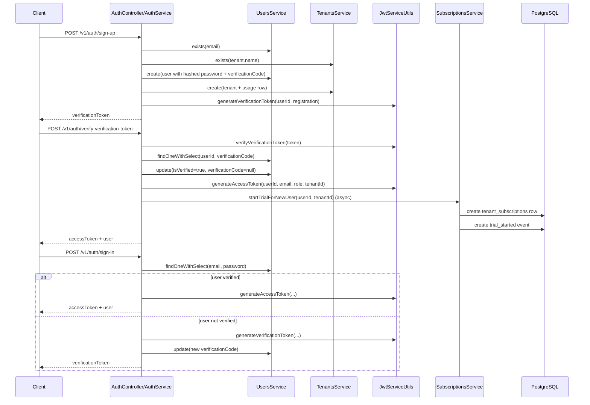

# Authentication Feature

## Scope

Authentication is JWT-based and currently covers user registration, account verification by OTP-style code plus verification token, and sign-in. There is no refresh-token endpoint, no session store, and no password-reset flow exposed by controllers.

Primary files:

- `src/auth/auth.controller.ts`
- `src/auth/auth.service.ts`
- `src/common/jwt/jwt.service.ts`
- `src/common/guards/jwt.guard.ts`
- `src/common/guards/roles.guard.ts`
- `src/common/utils/hashing.utils.ts`
- `src/users/users.service.ts`
- `src/tenants/tenants.service.ts`
- `prisma/schema/users.prisma`

## Identity Model

The `users` table stores:

- `email` unique login identifier (`prisma/schema/users.prisma`)
- `password` hashed with Argon2 (`src/common/utils/hashing.utils.ts`)
- `role` default `user` (`prisma/schema/users.prisma`)
- `isVerified` to gate full login (`prisma/schema/users.prisma`)
- `verificationCode` for OTP-style account confirmation (`prisma/schema/users.prisma`)

Each user may own one tenant through `Tenant.ownerId` (`prisma/schema/tenants.prisma`).

## Registration Flow

### Route

- `POST /v1/auth/sign-up` (`src/auth/auth.controller.ts`)
- Public endpoint via `@Public()` (`src/auth/auth.controller.ts`)

### Request payload

`SignupRequestDto` extends `CreateUserDto` and embeds `CreateTenantDto`:

- `fullName: string` (`src/users/dto/request/create-user.dto.ts`)
- `email: string` (`src/users/dto/request/create-user.dto.ts`)
- `password: string` with `MinLength(8)` (`src/users/dto/request/create-user.dto.ts`)
- `tenant.name: string` (`src/auth/dto/request/signup.request.dto.ts`, `src/tenants/dto/request/create-tenant.dto.ts`)

### Service flow

`AuthService.signupUser()` performs:

1. checks user email uniqueness with `UsersService.exists()` (`src/auth/auth.service.ts`, `src/users/users.service.ts`)
2. checks tenant name uniqueness with `TenantsService.exists()` (`src/auth/auth.service.ts`, `src/tenants/tenants.service.ts`)
3. hashes the password using Argon2 + `HASH_SECRET` (`src/auth/auth.service.ts`, `src/common/utils/hashing.utils.ts`)
4. generates a 6-digit numeric code (`src/auth/auth.service.ts`)
5. creates the user with:
   - `role = user`
   - `verificationCode = code`
   - `isVerified = false` by schema default (`src/auth/auth.service.ts`, `prisma/schema/users.prisma`)
6. creates the tenant and an empty usage row (`src/auth/auth.service.ts`, `src/tenants/tenants.service.ts`)
7. creates a JWT verification token with payload `{ sub: userId, type: 'registration' }` (`src/auth/auth.service.ts`, `src/common/jwt/jwt.service.ts`)
8. logs the OTP code instead of sending email/SMS; delivery is marked TODO (`src/auth/auth.service.ts`)

### Response

`SignupResponseDto` returns only:

- `verificationToken: string` (`src/auth/dto/response/signup.response.dto.ts`)

## Verification Flow

### Route

- `POST /v1/auth/verify-verification-token` (`src/auth/auth.controller.ts`)
- Public endpoint (`src/auth/auth.controller.ts`)

### Request payload

- `verificationToken: string`
- `code: string` (`src/auth/dto/request/verify-verification-token.request.dto.ts`)

### Service flow

`AuthService.verifyVerificationToken()`:

1. verifies the JWT using `JWT_VERIFICATION_TOKEN_SECRET` (`src/auth/auth.service.ts`, `src/common/jwt/jwt.service.ts`)
2. loads the user including `verificationCode` (`src/auth/auth.service.ts`, `src/users/users.service.ts`)
3. compares the submitted code to the stored code (`src/auth/auth.service.ts`)
4. loads the user profile including tenant (`src/auth/auth.service.ts`, `src/users/users.service.ts`)
5. generates the access token containing `sub`, `email`, `role`, and `tenantId` (`src/auth/auth.service.ts`, `src/common/jwt/jwt.service.ts`)
6. marks the user verified and clears `verificationCode` (`src/auth/auth.service.ts`, `src/users/users.service.ts`)
7. asynchronously starts the tenant’s free trial subscription (`src/auth/auth.service.ts`, `src/subscriptions/subscriptions.service.ts`)

### Response

`SigninResponseDto` returns:

- `accessToken`
- `user`

and does not return another verification token on success (`src/auth/dto/response/signin.response.dto.ts`).

## Sign-in Flow

### Route

- `POST /v1/auth/sign-in` (`src/auth/auth.controller.ts`)
- Public endpoint (`src/auth/auth.controller.ts`)

### Request payload

- `email: string`
- `password: string` (`src/auth/dto/request/signin.request.dto.ts`)

### Service flow

`AuthService.signinUser()`:

1. loads the user by email with password selected (`src/auth/auth.service.ts`, `src/users/users.service.ts`)
2. throws `NotFoundException('Wrong Credentials')` if the user is missing or password check fails (`src/auth/auth.service.ts`)
3. verifies the password using Argon2 (`src/auth/auth.service.ts`, `src/common/utils/hashing.utils.ts`)
4. if `isVerified` is false:
   - generates a new 6-digit code
   - generates a new verification token
   - updates `verificationCode`
   - logs the code
   - returns `{ verificationToken }` instead of an access token (`src/auth/auth.service.ts`)
5. if verified:
   - loads full profile
   - generates the access token with tenant context
   - returns `{ accessToken, user }` (`src/auth/auth.service.ts`)

## JWT and Request Authorization

### Access token contents

`generateAccessToken()` signs:

- `sub` = userId
- optional `role`
- optional `tenantId`
- optional `email` (`src/common/jwt/jwt.service.ts`)

Secret and expiry:

- secret: `JWT_ACCESS_SECRET`
- expiry: `JWT_ACCESS_EXPIRE` (`src/common/jwt/jwt.service.ts`, `.env.example`)

### Verification token contents

`generateVerificationToken()` signs:

- `sub` = userId
- `type` = `registration` or `forget_password` (`src/common/jwt/jwt.service.ts`)

Secret and expiry:

- secret: `JWT_VERIFICATION_TOKEN_SECRET`
- expiry: `JWT_VERIFICATION_TOKEN_EXPIRE` (`src/common/jwt/jwt.service.ts`, `.env.example`)

### Guard behavior

`JwtGuard` is global and:

- skips routes marked `@Public()` (`src/common/guards/jwt.guard.ts`)
- reads `Authorization: Bearer <token>` (`src/common/guards/jwt.guard.ts`)
- verifies with `JWT_ACCESS_SECRET` (`src/common/guards/jwt.guard.ts`, `src/common/jwt/jwt.service.ts`)
- attaches decoded claims to `request.user` (`src/common/guards/jwt.guard.ts`)
- returns `401 Unauthorized` on missing or invalid token (`src/common/guards/jwt.guard.ts`)

`RolesGuard` is also global and validates `@Roles()` metadata against `request.user.role` (`src/common/guards/roles.guard.ts`).

## Authenticated Endpoints that Depend on the Access Token

Examples:

- `GET /v1/users/me` requires `admin` or `user` (`src/users/users.controller.ts`)
- tenant routes require `user` and often `SubscriptionGuard` (`src/tenants/tenants.controller.ts`)
- admin dashboards require `admin` (`src/users/users.dashboard.controller.ts`, `src/plans/plans.controller.ts`)

## Security Measures

### Password hashing

- algorithm: Argon2 (`src/common/utils/hashing.utils.ts`)
- keyed secret: `HASH_SECRET` is supplied as Argon2 secret buffer (`src/common/utils/hashing.utils.ts`, `.env.example`)

### Input validation

- global `ValidationPipe` uses `whitelist: true`, `transform: true`, and `stopAtFirstError: true` (`src/main.ts`)
- invalid DTOs return `400 Bad Request` with the first constraint message (`src/main.ts`)

### JWT/session configuration

- access tokens are stateless JWTs; there is no server-side session store
- no cookie session is configured
- refresh-token generation exists in helper code only and is unused by controllers (`src/common/jwt/jwt.service.ts`)

### CORS and CSRF

- CORS is enabled with `origin = process.env.ORIGIN || '*'` (`src/main.ts`)
- there is no CSRF middleware because auth currently uses bearer tokens, not cookie sessions

### HTTP hardening

- `helmet()` is enabled globally (`src/main.ts`)
- Swagger is behind HTTP Basic auth using `SWAGGER_USER` and `SWAGGER_PASSWORD` (`src/main.ts`, `.env.example`)

### Sensitive field handling

`PrismaService` configures global field omission so ordinary Prisma result objects do not include `user.password` or `user.verificationCode` unless explicitly selected (`src/database/prisma.service.ts`).

## Auth API Reference

### `POST /v1/auth/sign-up`

- Headers: `Content-Type: application/json`
- Auth: none
- Rate limits: none configured
- Success: default NestJS `201` with `{ verificationToken }` because the controller does not override the POST status code (`src/auth/auth.controller.ts`)
- Common errors:
  - `409 User email exists` (`src/auth/auth.service.ts`)
  - `409 Tenant name exists` (`src/auth/auth.service.ts`)
  - `400` DTO validation errors from global pipe (`src/main.ts`)

### `POST /v1/auth/sign-in`

- Headers: `Content-Type: application/json`
- Auth: none
- Rate limits: none configured
- Success:
  - verified account -> `{ accessToken, user }`
  - unverified account -> `{ verificationToken }`
  - HTTP status is default NestJS `201` because the controller does not override the POST status code (`src/auth/auth.controller.ts`, `src/auth/auth.service.ts`)
- Common errors:
  - `404 Wrong Credentials` on missing user or password mismatch (`src/auth/auth.service.ts`)
  - `400` DTO validation failures

### `POST /v1/auth/verify-verification-token`

- Headers: `Content-Type: application/json`
- Auth: none
- Rate limits: none configured
- Success: default NestJS `201` with `{ accessToken, user }` because the controller does not override the POST status code (`src/auth/auth.controller.ts`, `src/auth/auth.service.ts`)
- Common errors:
  - `400 Invalid verification token or code` on JWT or OTP mismatch (`src/auth/auth.service.ts`)
  - `400` DTO validation failures

## Mermaid Sequence Diagram

## Current Constraints

- OTP delivery is not integrated; verification codes are only logged (`src/auth/auth.service.ts`).
- There is no rate-limiter or brute-force protection middleware in the current codebase.
- Verification uses token + code, but there is no resend endpoint beyond calling sign-in on an unverified account.
