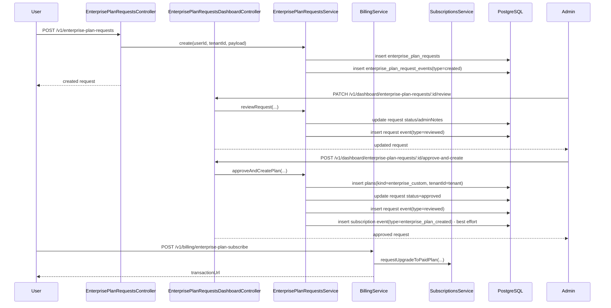

# Enterprise Plan Request Feature

## Scope

This document covers the tenant-side enterprise plan request flow, admin review and approval or rejection, request event logs, enterprise custom plan creation, and the later tenant subscription flow for the created enterprise plan.

Primary implementation files:

- Request APIs: `src/enterprise-plan-requests/enterprise-plan-requests.controller.ts`
- Admin APIs: `src/enterprise-plan-requests/enterprise-plan-requests.dashboard.controller.ts`
- Request lifecycle service: `src/enterprise-plan-requests/enterprise-plan-requests.service.ts`
- Request event query service: `src/enterprise-plan-requests/enterprise-plan-request-events.service.ts`
- Enterprise plan subscription APIs: `src/billing/billing.controller.ts`, `src/billing/billing.service.ts`
- Tenant enterprise-plan listing: `src/tenants/tenants.controller.ts`
- Persistence: `prisma/schema/enterprise-plan-request.prisma`, `prisma/schema/plans.prisma`, `prisma/schema/subscriptions.prisma`

## Data Model

### `enterprise_plan_requests`

The request row stores:

- `requestId`
- `tenantId`
- `title`
- `description`
- optional projected usage fields:
  - `expectedProjects`
  - `expectedUsers`
  - `expectedSessions`
  - `expectedRequests`
- workflow fields:
  - `status`
  - `adminNotes`
- timestamps:
  - `createdAt`
  - `updatedAt`

Source: `prisma/schema/enterprise-plan-request.prisma`.

Allowed statuses are defined in `EnterprisePlanRequestStatusEnum`:

- `pending`
- `contacted`
- `approved`
- `rejected`

Source: `src/common/enums/enterprise-plan-request-status.enum.ts`.

### `enterprise_plan_request_events`

This table logs request-related actions with:

- `eventId`
- `requestId`
- `type`
- `actorUserId`
- `meta`
- `createdAt`

Source: `prisma/schema/enterprise-plan-request.prisma`.

Event types are defined in `EnterprisePlanRequestEventTypeEnum`:

- `created`
- `reviewed`

Source: `src/common/enums/enterprise-plan-request-event-type.enum.ts`.

### `plans`

Admin approval creates a private `Plan` row with:

- `kind = enterprise_custom`
- `tenantId = request.tenantId`
- custom pricing and quotas from `CreateEnterprisePlanDto`

Source: `prisma/schema/plans.prisma`, `src/plans/dto/request/create-plan.dto.ts`, `src/common/enums/plan-kind.enum.ts`.

## User Flow

### 1. Create enterprise plan request

Route:

- `POST /v1/enterprise-plan-requests`

Auth and role:

- requires `Bearer` access token
- requires `user` role

Controller: `src/enterprise-plan-requests/enterprise-plan-requests.controller.ts`

Request body:

- `title: string`
- `description: string`
- optional:
  - `expectedProjects`
  - `expectedUsers`
  - `expectedSessions`
  - `expectedRequests`

DTO source: `src/enterprise-plan-requests/dto/request/create-enterprise-plan-request.dto.ts`

Service behavior in `EnterprisePlanRequestsService.create()`:

1. verifies the tenant exists
2. checks for an already-open request with status `pending` or `contacted`
3. creates a new `enterprise_plan_requests` row
4. creates an `enterprise_plan_request_events` row with:
   - `type = created`
   - `actorUserId = requesting user`
   - `meta = original request payload`

Source: `src/enterprise-plan-requests/enterprise-plan-requests.service.ts`

Business rule:

- one tenant cannot open another request while an existing request is still `pending` or `contacted`

Failure case:

- returns `400` with `You already have an open enterprise plan request` if such a request exists

### 2. User reads request history

User-facing read APIs:

- `GET /v1/enterprise-plan-requests`
- `GET /v1/enterprise-plan-requests/:id`
- `GET /v1/enterprise-plan-requests/:id/events`

Behavior:

- list endpoint is tenant-scoped automatically by `decodedUser.tenantId`
- detail endpoint passes `tenantId` into `getById()`
- event list is also filtered by both `requestId` and tenant

Source:

- `src/enterprise-plan-requests/enterprise-plan-requests.controller.ts`
- `src/enterprise-plan-requests/enterprise-plan-requests.service.ts`
- `src/enterprise-plan-requests/enterprise-plan-request-events.service.ts`

## Admin Flow

### 1. Review requests

Admin APIs:

- `GET /v1/dashboard/enterprise-plan-requests`
- `GET /v1/dashboard/enterprise-plan-requests/:id`
- `GET /v1/dashboard/enterprise-plan-requests/events`

Auth and role:

- requires `Bearer` access token
- requires `admin` role

Source: `src/enterprise-plan-requests/enterprise-plan-requests.dashboard.controller.ts`

### 2. Mark as contacted, approved, or rejected

Route:

- `PATCH /v1/dashboard/enterprise-plan-requests/:id/review`

Body:

- `status` must be one of:
  - `contacted`
  - `approved`
  - `rejected`
- optional `adminNotes`

DTO source: `src/enterprise-plan-requests/dto/request/review-enterprise-plan-request.dto.ts`

Service behavior in `reviewRequest()`:

1. loads the request by `requestId`
2. rejects the operation if the request is already `approved` or `rejected`
3. updates `status` and `adminNotes`
4. creates an event row with:
   - `type = reviewed`
   - `actorUserId = admin user`
   - `meta = review payload`

Source: `src/enterprise-plan-requests/enterprise-plan-requests.service.ts`

Important behavior:

- `approved` can be set here without creating a plan
- this endpoint only updates request workflow state and appends a request event

### 3. Approve and create enterprise plan

Route:

- `POST /v1/dashboard/enterprise-plan-requests/:id/approve-and-create`

Body:

- `name`
- optional `description`
- `monthlyPrice`
- `yearlyPrice`
- `currency`
- `maxProjects`
- `maxUsers`
- `maxSessions`
- `maxRequests`

DTO source: `src/plans/dto/request/create-plan.dto.ts`

Service behavior in `approveAndCreatePlan()`:

1. loads the request by `requestId`
2. rejects if the request status is already `rejected`
3. loads the tenant, including its current subscription
4. enforces unique plan name
5. creates a `plans` row with:
   - `kind = enterprise_custom`
   - `tenantId = request.tenantId`
6. updates the request to:
   - `status = approved`
   - `adminNotes = payload.description ?? existing adminNotes`
7. attempts to create two events in parallel:
   - request event:
     - `type = reviewed`
     - `actorUserId = admin user`
     - `meta = plan payload`
   - subscription event:
     - `type = enterprise_plan_created`
     - `toPlanId = created plan.planId`
     - `actorUserId = admin user`
     - metadata with request ID, tenant ID, and plan pricing

Source: `src/enterprise-plan-requests/enterprise-plan-requests.service.ts`

## Event Logs

### Request event log

Request events are queried through:

- user: `GET /v1/enterprise-plan-requests/:id/events`
- admin: `GET /v1/dashboard/enterprise-plan-requests/events`

Querying is implemented by `EnterprisePlanRequestEventsService.findAllPaging()` and sorted by `createdAt desc`.

Source: `src/enterprise-plan-requests/enterprise-plan-request-events.service.ts`

Event emission points:

- request creation -> `created`
- admin review -> `reviewed`
- approve-and-create -> another `reviewed`

Source: `src/enterprise-plan-requests/enterprise-plan-requests.service.ts`

### Subscription event log

When an enterprise plan is created, the service also attempts to append a subscription event with type `enterprise_plan_created`.

Source: `src/common/enums/subscription-event-type.enum.ts`, `src/enterprise-plan-requests/enterprise-plan-requests.service.ts`

Important implementation detail:

- this subscription event write is best-effort only
- it is wrapped in `.catch(() => undefined)`
- if the tenant has no subscription, the service passes `tenant.subscription?.subscriptionId ?? ''`, so the insert can fail and be silently ignored

This means enterprise plan creation is authoritative in the `plans` table and request status, but the related subscription event log is not guaranteed to exist.

## Enterprise Plan Creation Output

Approval creates a tenant-private plan, not a tenant subscription.

What is created immediately:

- `enterprise_plan_requests.status = approved`
- one `plans` row with `kind = enterprise_custom`
- one request event row with `type = reviewed`
- optionally one subscription event row with `type = enterprise_plan_created`

What is not created automatically:

- no new `tenant_subscriptions` row
- no automatic switch of the tenant’s current subscription to the enterprise plan
- no payment request by itself

This is an important separation in the current design: request approval provisions the enterprise plan catalog entry, then the tenant still needs to subscribe to that plan through billing.

## Tenant Subscription to the Approved Enterprise Plan

### Discover available enterprise plans

Route:

- `GET /v1/tenants/enterprise-plans`

Behavior:

- lists `Plan` rows filtered by:
  - `tenantId = decodedUser.tenantId`
  - `kind = enterprise_custom`

Source: `src/tenants/tenants.controller.ts`

### Subscribe to the enterprise plan

Route:

- `POST /v1/billing/enterprise-plan-subscribe`

Body:

- `planId`
- `billingCycle`

Source:

- `src/billing/billing.controller.ts`
- `src/billing/billing.service.ts`

Validation in `BillingService.subscripeToEnterprisePlan()`:

1. tenant exists
2. plan exists
3. `plan.kind` must be `enterprise_custom`
4. `plan.tenantId` must equal the caller tenant ID
5. tenant must not already be on that plan

If valid, the service:

1. calls `SubscriptionsService.requestUpgradeToPaidPlan()`
2. creates an initial Tap payment request through `createInitialChargeWithSaveCard()`
3. returns a hosted `transactionUrl`

The actual subscription activation still happens later through the billing webhook and subscription activation flow.

## Mermaid Sequence Diagram

## API Summary

### User endpoints

- `POST /v1/enterprise-plan-requests`
- `GET /v1/enterprise-plan-requests`
- `GET /v1/enterprise-plan-requests/:id`
- `GET /v1/enterprise-plan-requests/:id/events`
- `GET /v1/tenants/enterprise-plans`
- `POST /v1/billing/enterprise-plan-subscribe`

### Admin endpoints

- `GET /v1/dashboard/enterprise-plan-requests`
- `GET /v1/dashboard/enterprise-plan-requests/:id`
- `GET /v1/dashboard/enterprise-plan-requests/events`
- `PATCH /v1/dashboard/enterprise-plan-requests/:id/review`
- `POST /v1/dashboard/enterprise-plan-requests/:id/approve-and-create`

## Current Constraints

- only one open request per tenant is allowed while status is `pending` or `contacted`
- `approve-and-create` does not prevent re-approval of an already approved request; it only blocks rejected requests
- request review and plan creation both emit request events with the same `reviewed` type
- enterprise plan creation does not automatically subscribe the tenant
- the subscription event `enterprise_plan_created` is best-effort and may be absent if the insert fails
