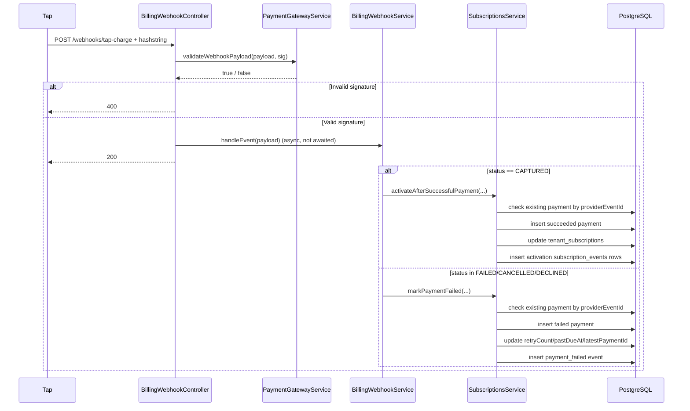
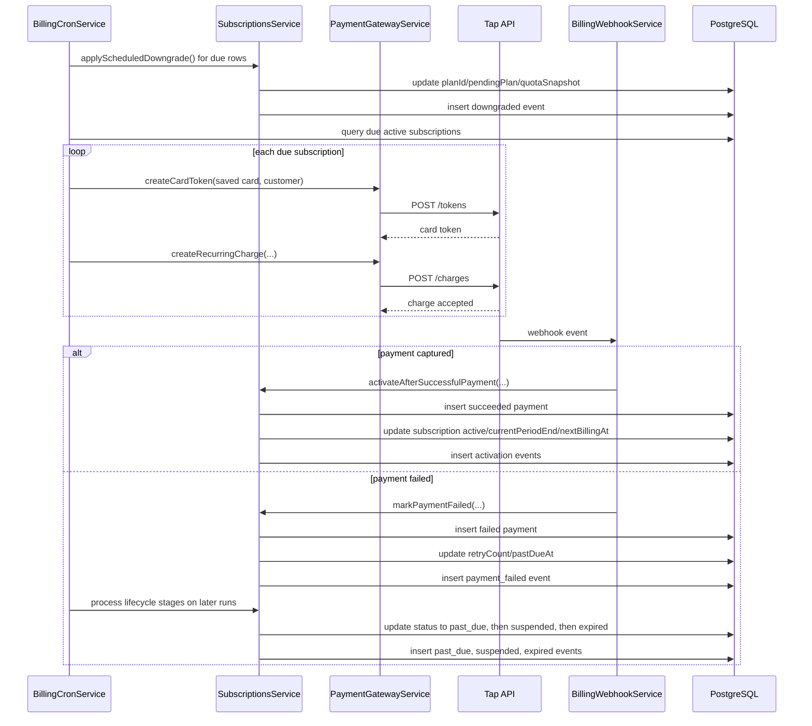

# Plans and Subscriptions Feature

## Scope

This document covers plan storage, trial bootstrap, paid subscription upgrades, enterprise plan subscription, downgrade scheduling, webhook activation, recurring billing cron behavior, quota checks, and payment/event persistence.

Primary implementation files:

- Plans: `src/plans/plans.controller.ts`, `src/plans/plans.service.ts`
- Billing endpoints: `src/billing/billing.controller.ts`, `src/billing/billing.service.ts`
- Subscription lifecycle: `src/subscriptions/subscriptions.service.ts`
- Subscription guard and quotas: `src/common/guards/subscription.guard.ts`, `src/subscriptions/subscription-usage-limits.service.ts`, `src/tenants/tenant-profiles.service.ts`
- Webhooks: `src/billing/webhook/billing-webhook.controller.ts`, `src/billing/webhook/billing-webhook.service.ts`
- Cron: `src/billing/billing-cron.service.ts`
- Persistence: `prisma/schema/plans.prisma`, `prisma/schema/subscriptions.prisma`, `prisma/schema/payments.prisma`

## Data Model

### `plans`

Stored in `plans` with:

- identity and display: `plan_id`, `name`, `description`, `sortOrder`, `is_active` (`prisma/migrations/20260425165036_init/migration.sql`)
- commercial terms: `kind`, `monthly_price`, `yearly_price`, `currency` (`prisma/schema/plans.prisma`)
- tenancy binding: optional `tenant_id` for `enterprise_custom` plans only (`prisma/schema/plans.prisma`)
- quotas: `max_projects`, `max_users`, `max_sessions`, `max_requests` (`prisma/schema/plans.prisma`)
- trial definition: `trial_days` (`prisma/schema/plans.prisma`)

### `tenant_subscriptions`

Each tenant has at most one subscription (`tenant_id` unique). The row stores:

- active plan and current status (`prisma/schema/subscriptions.prisma`)
- trial and billing period timestamps (`prisma/schema/subscriptions.prisma`)
- cancellation / grace / suspension timestamps (`prisma/schema/subscriptions.prisma`)
- pending plan for immediate activation or scheduled downgrade (`prisma/schema/subscriptions.prisma`)
- immutable commercial snapshots for the active cycle: `priceSnapshot`, `quotaSnapshot` (`prisma/schema/subscriptions.prisma`)
- Tap recurring identifiers: `tapCustomerId`, `tapCardId`, `tapPaymentAgreementId` (`prisma/schema/subscriptions.prisma`)
- payment linkage and retry counter (`prisma/schema/subscriptions.prisma`)

### `subscription_payments`

The payment ledger is append-only and de-duplicates by `provider_event_id` and `provider_payment_ref` unique indexes (`prisma/schema/payments.prisma`, `prisma/migrations/20260425165036_init/migration.sql`).

### `subscription_events`

Business events are stored separately from payment rows, including trial start, trial expiration, payment pending, payment failed, renewals, upgrades, scheduled downgrades, applied downgrades, cancellation, past due, suspension, expiration, and reactivation (`prisma/schema/subscriptions.prisma`, `src/common/enums/subscription-event-type.enum.ts`).

## Plan Management

### Standard plans

Admin CRUD is exposed under `/v1/plans` and restricted to `admin` role (`src/plans/plans.controller.ts`).

Rules enforced by `PlansService`:

- plan names must be unique on create/update (`src/plans/plans.service.ts`)
- free plan prices cannot be changed once both monthly and yearly prices are `0` (`src/plans/plans.service.ts`)
- free plans cannot be deleted (`src/plans/plans.service.ts`)
- plans with active subscriptions or a bound tenant cannot be deleted (`src/plans/plans.service.ts`)
- public landing-page listing returns only `kind = standard` and `isActive = true`, ordered by `sortOrder` (`src/plans/plans.service.ts`)

### Seeded public catalog

The repository seeds three standard plans (`prisma/seed-data/plan.seed.data.ts`):

- `Free Plan`: monthly/yearly `0`, `trialDays = 14`, quota `2` for all counters (`prisma/seed-data/plan.seed.data.ts`)
- `Basic Plan`: monthly `20`, yearly `200` (`prisma/seed-data/plan.seed.data.ts`)
- `Pro Plan`: monthly `50`, yearly `500` (`prisma/seed-data/plan.seed.data.ts`)

### Enterprise custom plans

Admin approval creates a private plan with `kind = enterprise_custom` and `tenantId = request.tenantId` (`src/enterprise-plan-requests/enterprise-plan-requests.service.ts`). Access to such plans is guarded later by tenant ownership checks in both `SubscriptionsService` and `SubscriptionGuard` (`src/subscriptions/subscriptions.service.ts`, `src/common/guards/subscription.guard.ts`).

## Standard Subscriptions vs. Immutable Free Plan Trialing

### Free plan trialing

Free plan subscription is not initiated through billing endpoints. It is created only after registration verification:

1. `POST /v1/auth/sign-up` creates the user and tenant (`src/auth/auth.service.ts`).
2. `POST /v1/auth/verify-verification-token` verifies the OTP and asynchronously calls `startTrialForNewUser()` (`src/auth/auth.service.ts`).
3. `startTrialForNewUser()` selects the first active standard plan with `trialDays > 0` and creates a `trialing` subscription with `priceSnapshot` and `quotaSnapshot` copied from that plan (`src/subscriptions/subscriptions.service.ts`).

The code treats free trialing as immutable in three ways:

- plan prices cannot later be edited if both prices are zero (`src/plans/plans.service.ts`)
- free plans cannot be deleted (`src/plans/plans.service.ts`)
- paid-upgrade flow rejects zero-priced plans with `Use trial flow for free plans` (`src/subscriptions/subscriptions.service.ts`)

### Paid standard subscriptions

Paid standard subscriptions reuse the same `tenant_subscriptions` row. The tenant starts on trial, then moves to a paid standard plan by:

1. setting `pendingPlanId` immediately in `requestUpgradeToPaidPlan()` (`src/subscriptions/subscriptions.service.ts`)
2. opening a Tap hosted charge URL from `BillingService.upgradePlan()` (`src/billing/billing.service.ts`)
3. waiting for the webhook to convert that pending plan into the active plan via `activateAfterSuccessfulPayment()` (`src/billing/webhook/billing-webhook.service.ts`, `src/subscriptions/subscriptions.service.ts`)

### Upgrade and downgrade semantics

- Upgrade requests are immediate from the application perspective: `pendingPlanEffectiveAt` is set to `now`, and activation happens on successful payment (`src/subscriptions/subscriptions.service.ts`).
- Downgrades are deferred: `pendingPlanEffectiveAt` is set to `currentPeriodEnd`, and cron applies the downgrade once due (`src/subscriptions/subscriptions.service.ts`, `src/billing/billing-cron.service.ts`).
- Enterprise custom plan subscription uses the same upgrade path but validates `plan.kind === enterprise_custom` and `plan.tenantId === tenantId` before payment creation (`src/billing/billing.service.ts`).

### Cancellation, suspension, and expiration

- User cancellation is now a period-end cancellation request: it sets `cancelAtPeriodEnd = true` and leaves the subscription in `active` or `past_due` until `currentPeriodEnd` (`src/subscriptions/subscriptions.service.ts`).
- Recurring billing cron excludes `cancelAtPeriodEnd = true`, so pending cancellations do not renew again (`src/billing/billing-cron.service.ts`).
- Lifecycle cron later finalizes those rows into `status = cancelled`, sets `cancelledAt`, clears `nextBillingAt`, and writes a second cancellation event tagged with `finalizedByCron` (`src/subscriptions/subscriptions.service.ts`).
- `SubscriptionGuard` blocks both `cancelled` and `expired` subscriptions on protected routes (`src/common/guards/subscription.guard.ts`).
- `expired` is now a real terminal state: suspended subscriptions older than 60 days are moved to `expired` and emit an `expired` event (`src/subscriptions/subscriptions.service.ts`).

## Subscription State Machine

### Implemented states

- `trialing`
- `active`
- `past_due`
- `suspended`
- `cancelled`
- `expired`

### Transitions actually implemented

- `verification -> trialing`: `startTrialForNewUser()` (`src/subscriptions/subscriptions.service.ts`)
- `trialing -> trialing + trial_expired event`: lifecycle cron emits `trial_expired` once `trialEndsAt <= now`, without changing status (`src/subscriptions/subscriptions.service.ts`)
- `trialing -> active`: successful first payment webhook (`src/subscriptions/subscriptions.service.ts`)
- `active|past_due|suspended -> active`: renewal success, paid upgrade activation, or payment recovery all write `active` (`src/subscriptions/subscriptions.service.ts`)
- `active|past_due -> active|past_due + cancelAtPeriodEnd`: user cancellation request schedules end-of-period cancellation (`src/subscriptions/subscriptions.service.ts`)
- `active -> active + pastDueAt + retryCount++`: failed charge records failure but keeps status `active` initially (`src/subscriptions/subscriptions.service.ts`)
- `active with stale pastDueAt -> past_due`: lifecycle cron after 3 days (`src/subscriptions/subscriptions.service.ts`)
- `past_due -> suspended`: lifecycle cron after 7 days in `past_due`, based on `updatedAt` (`src/subscriptions/subscriptions.service.ts`)
- `suspended -> expired`: lifecycle cron after 60 days from `suspendedAt` (`src/subscriptions/subscriptions.service.ts`)
- `active|past_due with cancelAtPeriodEnd and due period end -> cancelled`: lifecycle cron finalization (`src/subscriptions/subscriptions.service.ts`)
- `suspended -> active`: successful resubscribe payment (`src/subscriptions/subscriptions.service.ts`)
- `active -> downgraded active`: scheduled downgrade cron swaps `planId` and clears pending plan (`src/subscriptions/subscriptions.service.ts`)

## Complete Lifecycle Walkthrough

### 1. Trial creation

- Trigger: account verification.
- Subscription row fields set:
  - `status = trialing`
  - `trialEndsAt = now + trialDays`
  - `currentPeriodStart = now`
  - `currentPeriodEnd = trialEndsAt`
  - `billingCycle = monthly`
  - `nextBillingAt = trialEndsAt`
  - `priceSnapshot = trialPlan.monthlyPrice`
  - `quotaSnapshot` copied from the plan (`src/subscriptions/subscriptions.service.ts`)
- Event written: `trial_started` (`src/subscriptions/subscriptions.service.ts`)

### 2. Upgrade request / first paid subscription

- Route: `POST /v1/billing/plan-upgrade`
- Service sets `pendingPlanId` to target plan immediately and writes `payment_pending` event (`src/subscriptions/subscriptions.service.ts`)
- Billing service creates an initial Tap charge with `save_card = true` to capture reusable payment agreement/card/customer IDs (`src/billing/billing.service.ts`, `src/payment-gateway/tap-payment-provider/tap-payment-provider.service.ts`)

### 3. Webhook activation

- Tap posts to `POST /webhooks/tap-charge` with header `hashstring` (`src/billing/webhook/billing-webhook.controller.ts`)
- Controller validates HMAC signature; on success it asynchronously dispatches `handleEvent()` and returns `200` immediately (`src/billing/webhook/billing-webhook.controller.ts`)
- Success path stores payment, activates plan, copies recurring fields, clears pending-plan fields, resets retries, and writes activation events (`src/subscriptions/subscriptions.service.ts`)

### 4. Renewal

- Hourly cron selects `active` subscriptions where `nextBillingAt <= now`, `cancelAtPeriodEnd = false`, provider is `tap`, and `retryCount < 3` (`src/billing/billing-cron.service.ts`)
- It creates a Tap card token from saved card/customer IDs and submits a recurring charge referencing the saved payment agreement (`src/billing/billing-cron.service.ts`)
- Webhook success re-enters `activateAfterSuccessfulPayment()` and extends the period by `30` or `365` days from the current time (`src/subscriptions/subscriptions.service.ts`)

### 5. Failed renewal and grace handling

- Webhook failure creates a failed payment row keyed by `providerEventId`, increments `retryCount`, sets `pastDueAt`, and writes `payment_failed` (`src/subscriptions/subscriptions.service.ts`)
- A separate 30-minute cron emits `trial_expired`, marks still-unresolved subscriptions `past_due` after 3 days, `suspended` after 7 days in `past_due`, and `expired` after 60 days in `suspended` (`src/subscriptions/subscriptions.service.ts`, `src/billing/billing-cron.service.ts`)

### 6. Resubscribe suspended plan

- Route: `POST /v1/billing/plan-resubscribe`
- Only `suspended` subscriptions are allowed, and the reactivation window is 60 days from `suspendedAt` or `updatedAt` (`src/subscriptions/subscriptions.service.ts`)
- Payment is collected through the same “initial charge with save card” path (`src/billing/billing.service.ts`)
- Webhook success writes `reactivated` and resets the subscription to `active` (`src/subscriptions/subscriptions.service.ts`)

### 7. Cancel at period end

- Route: `POST /v1/billing/subscription-plan-cancel`
- Only `active` and `past_due` subscriptions are accepted (`src/subscriptions/subscriptions.service.ts`)
- The request sets `cancelAtPeriodEnd = true` and writes a `cancelled` event whose metadata includes `effectiveAt = currentPeriodEnd` (`src/subscriptions/subscriptions.service.ts`)
- The subscription remains usable until lifecycle cron sees `currentPeriodEnd <= now`, then switches it to `cancelled`, sets `cancelledAt`, clears `nextBillingAt`, and writes another `cancelled` event with `finalizedByCron = true` (`src/subscriptions/subscriptions.service.ts`)

## Subscription and Quota Usage Guards

### Route-level state enforcement

`SubscriptionGuard` runs on selected tenant routes and checks:

- tenant context exists in JWT (`src/common/guards/subscription.guard.ts`)
- subscription exists for the tenant (`src/common/guards/subscription.guard.ts`)
- enterprise custom plans belong to the same tenant (`src/common/guards/subscription.guard.ts`)
- allowed states from `@RequireSubscription()` metadata (`src/common/guards/subscription.guard.ts`)
- trial and period timestamps are not already past (`src/common/guards/subscription.guard.ts`)

State policy is per route. Examples:

- tenant profile/subscription/usage allow `trial`, `active`, `past_due`, `suspended` (`src/tenants/tenants.controller.ts`)
- tenant profile update and usage mutation endpoints disallow `past_due` and `suspended` (`src/tenants/tenants.controller.ts`)
- enterprise-only endpoint requires `active` or `past_due`, and requires the tenant’s own enterprise plan (`src/tenants/tenants.controller.ts`)

### Quota enforcement

`@RequireQuota()` attaches a plan quota key such as `maxProjects` (`src/common/decorators/require-quota.decorator.ts`). `SubscriptionGuard` reads the current plan and tenant usage, then delegates to `SubscriptionUsageLimitsService` (`src/common/guards/subscription.guard.ts`).

Quota checks compare the current counters to the plan limit:

- `projectsCount` vs `maxProjects` (`src/subscriptions/subscription-usage-limits.service.ts`)
- `usersCount` vs `maxUsers` (`src/subscriptions/subscription-usage-limits.service.ts`)
- `sessionsCount` vs `maxSessions` (`src/subscriptions/subscription-usage-limits.service.ts`)
- `requestsCount` vs `maxRequests` (`src/subscriptions/subscription-usage-limits.service.ts`)

`TenantProfilesService.tenantSubscriptionUse()` repeats the same check before incrementing counters, so service-level calls cannot bypass guards (`src/tenants/tenant-profiles.service.ts`).

## Billing Endpoints

All versioned billing routes are under `/v1/billing/*` except the Tap webhook, which is version-neutral.

### `GET /v1/billing/plans`

- Auth: public (`src/billing/billing.controller.ts`)
- Response: active standard plans ordered by `sortOrder` (`src/plans/plans.service.ts`)
- Headers: none required
- Rate limit: none configured in codebase

### `POST /v1/billing/plan-upgrade`

- Auth: `Bearer <accessToken>`, role `user` (`src/billing/billing.controller.ts`)
- Body: `{ "planId": string, "billingCycle": "monthly" | "yearly" }` (`src/billing/dto/request/upgrade-plan.dto.ts`)
- Response: `{ transactionUrl }` (`src/billing/billing.service.ts`)
- Business checks:
  - tenant exists (`src/billing/billing.service.ts`)
  - target plan exists and is active (`src/subscriptions/subscriptions.service.ts`)
  - target enterprise plan must belong to caller tenant (`src/subscriptions/subscriptions.service.ts`)
  - target plan must not be free (`src/subscriptions/subscriptions.service.ts`)
  - target plan must differ from current plan (`src/subscriptions/subscriptions.service.ts`)
- Idempotency:
  - no HTTP idempotency key/header is accepted
  - duplicate webhook completion is later deduplicated by `provider_event_id` (`src/subscriptions/subscriptions.service.ts`)

### `POST /v1/billing/enterprise-plan-subscribe`

- Auth: `Bearer <accessToken>`, role `user` (`src/billing/billing.controller.ts`)
- Body: same as upgrade (`src/billing/dto/request/upgrade-plan.dto.ts`)
- Response: `{ transactionUrl }` (`src/billing/billing.service.ts`)
- Additional checks:
  - plan exists (`src/billing/billing.service.ts`)
  - plan kind is `enterprise_custom` (`src/billing/billing.service.ts`)
  - plan belongs to caller tenant (`src/billing/billing.service.ts`)
  - tenant is not already on that plan (`src/billing/billing.service.ts`)

### `POST /v1/billing/plan-downgrade`

- Auth: `Bearer <accessToken>`, role `user` (`src/billing/billing.controller.ts`)
- Body: `{ "planId": string }` (`src/billing/dto/request/downgrade-plan.dto.ts`)
- Response: success message (`src/billing/billing.service.ts`)
- Effect: sets `pendingPlanId` and `pendingPlanEffectiveAt = currentPeriodEnd` (`src/subscriptions/subscriptions.service.ts`)

### `POST /v1/billing/plan-resubscribe`

- Auth: `Bearer <accessToken>`, role `user` (`src/billing/billing.controller.ts`)
- Body: `{ "billingCycle": "monthly" | "yearly" }` (`src/billing/dto/request/resubscribe-suspended-plan.dto.ts`)
- Response: `{ transactionUrl }` (`src/billing/billing.service.ts`)
- Checks:
  - tenant exists (`src/billing/billing.service.ts`)
  - subscription status is `suspended` (`src/subscriptions/subscriptions.service.ts`)
  - reactivation window is 60 days (`src/subscriptions/subscriptions.service.ts`)

### `POST /v1/billing/subscription-plan-cancel`

- Auth: `Bearer <accessToken>`, role `user` (`src/billing/billing.controller.ts`)
- Body: none
- Response: success message (`src/billing/billing.service.ts`)
- Effect: schedules cancellation by setting `cancelAtPeriodEnd = true`; status is finalized later by lifecycle cron when `currentPeriodEnd <= now` (`src/subscriptions/subscriptions.service.ts`)

### `GET /v1/billing/after-charge`

- Auth: public (`src/billing/billing.controller.ts`)
- Purpose: simple redirect landing message only; not part of state mutation.

## Webhook Handling

### Endpoint contract

- Route: `POST /webhooks/tap-charge` (`src/billing/webhook/billing-webhook.controller.ts`)
- Versioning: neutral, not `/v1` (`src/billing/webhook/billing-webhook.controller.ts`)
- Auth: no JWT, `@Public()` (`src/billing/webhook/billing-webhook.controller.ts`)
- Signature header: `hashstring` (`src/billing/webhook/billing-webhook.controller.ts`)

### Signature verification

`TapPaymentGatewayService.validateWebhookPayload()` rebuilds a concatenated string from:

- `id`
- rounded `amount`
- `currency`
- `reference.gateway`
- `reference.payment`
- `status`
- `transaction.created`

It then computes `HMAC-SHA256(secret = TAP_PAYMENT_API_KEY)` and compares it to the posted hash (`src/payment-gateway/tap-payment-provider/tap-payment-provider.service.ts`).

### Event routing

`BillingWebhookService.handleEvent()` interprets Tap status as:

- `CAPTURED` -> `activateAfterSuccessfulPayment()` (`src/billing/webhook/billing-webhook.service.ts`)
- `FAILED`, `CANCELLED`, `DECLINED` -> `markPaymentFailed()` (`src/billing/webhook/billing-webhook.service.ts`)

The handler also extracts:

- `tapPaymentAgreementId`
- `tapCardId`
- `tapCustomerId`
- `tenantId` from `event.metadata.tenantId` (`src/billing/webhook/billing-webhook.service.ts`)

If `tenantId` is absent, the event is ignored (`src/billing/webhook/billing-webhook.service.ts`).

### Idempotent processing

Webhook idempotency is implemented in the subscription service, not the controller:

- successful events exit early if a payment already exists for `providerEventId` (`src/subscriptions/subscriptions.service.ts`)
- failed events also exit early on duplicate `providerEventId` (`src/subscriptions/subscriptions.service.ts`)
- the database additionally enforces unique `provider_event_id` and `provider_payment_ref` (`prisma/migrations/20260425165036_init/migration.sql`)

### Error and retry behavior

- Invalid signature returns `400` (`src/billing/webhook/billing-webhook.controller.ts`)
- Exceptions during verification also return `400` (`src/billing/webhook/billing-webhook.controller.ts`)
- On a valid signature, the controller returns `200` immediately after firing the async handler without awaiting it (`src/billing/webhook/billing-webhook.controller.ts`)
- Because the controller acknowledges before business completion, Tap-level retries depend on whether the signature or controller itself fails; application-level handler failures after `200` are only visible via logs.

### Logging

- controller uses `console.log()` for webhook receipt and invalid hash messages (`src/billing/webhook/billing-webhook.controller.ts`)
- service logs webhook payload and loaded subscription through pino (`src/billing/webhook/billing-webhook.service.ts`)
- Tap provider logs external API successes and failures (`src/payment-gateway/tap-payment-provider/tap-payment-provider.service.ts`)

## Mermaid Sequence Diagram: Webhook Processing

## Billing Cron Jobs

### Schedule configuration

- `processDueBilling()` runs every hour (`src/billing/billing-cron.service.ts`)
- `applySubscriptionLifecycleRules()` runs every 30 minutes (`src/billing/billing-cron.service.ts`)

`ScheduleModule.forRoot()` is enabled globally in `AppModule` (`src/app.module.ts`).

### Hourly cron: scheduled downgrades + renewals

Order is explicit:

1. apply scheduled downgrades (`src/billing/billing-cron.service.ts`)
2. process due renewals (`src/billing/billing-cron.service.ts`)

#### Downgrade application

The cron selects subscriptions where:

- `status = active`
- `pendingPlanId IS NOT NULL`
- `pendingPlanEffectiveAt <= now` (`src/billing/billing-cron.service.ts`)

It calls `applyScheduledDowngrade()` per row (`src/billing/billing-cron.service.ts`), which:

- swaps `planId` to `pendingPlanId`
- clears pending-plan fields
- updates `priceSnapshot`
- updates `quotaSnapshot`
- writes `downgraded` event (`src/subscriptions/subscriptions.service.ts`)

#### Recurring renewals

The cron renews only subscriptions matching:

- `status = active`
- `nextBillingAt <= now`
- `cancelAtPeriodEnd = false`
- `paymentProvider = tap`
- `retryCount < 3` (`src/billing/billing-cron.service.ts`)

For each row:

- missing Tap recurring IDs causes a warning and skip (`src/billing/billing-cron.service.ts`)
- `createCardToken()` generates a reusable token from saved Tap card/customer IDs (`src/billing/billing-cron.service.ts`)
- amount is computed from current plan and billing cycle (`src/billing/billing-cron.service.ts`)
- `createRecurringCharge()` sends the charge to Tap (`src/billing/billing-cron.service.ts`)
- subscription mutation waits for webhook confirmation (`src/billing/billing-cron.service.ts`)

### 30-minute cron: lifecycle rules

`applySubscriptionLifecycleRules()` now runs five explicit stages:

1. `processTrialExpirations()`
2. `movePastDueSubscriptions()`
3. `moveSuspendedSubscriptions()`
4. `moveExpiredSubscriptions()`
5. `moveCancelledSubscriptions()` (`src/billing/billing-cron.service.ts`)

Implemented timeline:

- when `trialing` and `trialEndsAt <= now`: emit `trial_expired` once, without changing subscription status (`src/subscriptions/subscriptions.service.ts`)
- after 3 days: `active` with `pastDueAt != null` becomes `past_due` (`src/subscriptions/subscriptions.service.ts`)
- after 7 days in `past_due`, based on `updatedAt`: it becomes `suspended` and sets `suspendedAt = now` (`src/subscriptions/subscriptions.service.ts`)
- after 60 days in `suspended`, based on `suspendedAt`: it becomes `expired` and clears `nextBillingAt` (`src/subscriptions/subscriptions.service.ts`)
- when `cancelAtPeriodEnd = true` and `currentPeriodEnd <= now`: `active` or `past_due` becomes `cancelled`, `cancelledAt` is set, and `nextBillingAt` is cleared (`src/subscriptions/subscriptions.service.ts`)

There is still no cleanup job for:

- deleting cancelled subscriptions
- archiving old payments/events
- resetting usage counters on renewal

### Grace period and retries

- failed charge increments `retryCount` up to `3` (`src/subscriptions/subscriptions.service.ts`)
- hourly renewal cron skips subscriptions already at `retryCount >= 3` (`src/billing/billing-cron.service.ts`)
- the code records `lastGraceWarningAt`, but does not send notifications or update it again after the initial failure (`src/subscriptions/subscriptions.service.ts`)

## Mermaid Sequence Diagram: Cron Renewal and State Update

## Gaps Worth Knowing

- Webhook acknowledgment is asynchronous, so post-ack handler failures rely on logs rather than webhook retries.
